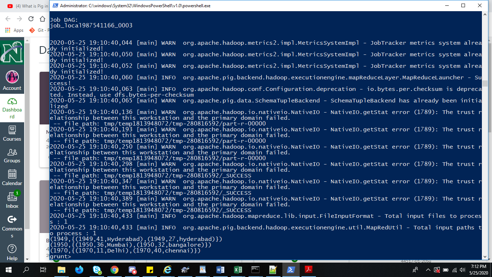

# Apache_Pig
Big data project using Apache Pig

## Team members Names:
1. Sushma Yedugani
1. Nikitha Kethireddy
1. Deepthi Tejaswani Chokka
1. Deepak Malempati

## Team Members GitHub profile links:
1. https://github.com/sushma95
1. https://github.com/nikithakethireddy1996
1. https://github.com/Deepthi1003
1. https://github.com/Deepakmalempati

## Team Members Images:
    
 
## Introduction to Apache-Pig:
Apache Pig is a platform for analyzing large data sets that consists of a high-level language for expressing data analysis programs, coupled with infrastructure for evaluating these programs. The salient property of Pig programs is that their structure is amenable to substantial parallelization, which in turns enables them to handle very large data sets.<br>

## Features of Apache-Pig:
#### ```Rich set of operators :``` <br>
Apache pig has a rich collection set of operators in order to perform operations like join, filer, and sort.
#### ```Ease of Programming :``` <br>
Pig Latin is similar to SQL so it is very easy for developers to write a Pig script. If we have knowledge of SQL language, then it is very easy to learn Pig Latin language as it is similar to SQL language.
#### ```Optimization opportunities :``` <br> 
In Apache pig has automatically optimized  execution of the task gets by itself, hence the programmers need to focus only on the semantics of the language.
#### ```Extensibility :``` <br> 
Using the existing operators in Apache pig, users can develop their own functions to read, process, and write data.
#### ```User Define Functions :``` <br>
Apache Pig provides the facility to create User-defined Functions easily in other language like java then invoke them in PigLatin Scripts.
#### ```ETL (Extract Transform Load) :``` <br>
Apache Pig extracts the huge data set, performs operations on huge data and dumps the data in the required format in HDFS.

## Applications of Apache-Pig:
* It is used to process huge data sources like web logs, streaming online data etc.
* It Support Ad Hoc queries across large data set.
* Used to perform data processing in search platforms.
* It is also used to process time sensitive data loads.
* Apache Pig is generally used by data scientists for performing tasks like ad-hoc processing and quick prototyping.

## Installation steps of Apache-Pig:
1. Download Apache Pig from http://apache.mirrors.lucidnetworks.net/pig/pig-0.17.0/ (file to download: pig-0.17.0.tar.gz)
1. Copy the file to C drive.
1. Open Powershell in C drive and unzip the downloaded file using <br>
```tar -xzvf pig-0.17.0.tar.gz```
1. pig-0.17.0 folder will be created.
1. Set Below paths in environment variables
     ```
     PIG_HOME - C:\pig-0.17.0
     Path - %PIG_HOME%\bin
     ```
1. open the file pig.cmd(From bin directory of PIG) using vscode   
    - look for the line <br>
    ```set HADOOP_BIN_PATH=%HADOOP_HOME%\bin```    
    - replace this with <br>
    ```set HADOOP_BIN_PATH=%HADOOP_HOME%\libexec``` 
1. To verify installation run the following command using powershell <br>
    ```pig --version``` 
          or
    ```pig -version```
    
## Apache Pig commands executed by Deepak to sort the dataset and find minimum duration of a movie
1. I used input.txt file which contains data of netflix movies
2. Steps to run Apache Pig in local mode  
   ```pig -x local```
2. Command to load new dataset into pig
```
netflix_list = LOAD 'input.txt' using PigStorage(',')
AS
(show_id:chararray,type:chararray,title:chararray,director:chararray,cast:chararray,country:chararray,date_added:chararray,release_year:chararray,rating:chararray,duration:chararray,listed_in:chararray);
```

4. Command to retrive only ID, Title and duration coulmns from the dataset
```
foreachlist = foreach netflix_list generate show_id, title, duration;
```
5. Command to display the output in the grunt console.
```
dump foreachlist;
```


6. Command to arrange movies list by shortest duration
```
grouping = group foreachlist by duration;

lowest_duration = foreach grouping generate group, MIN(foreachlist.duration);
dump lowest_duration;
```


## Apache-Pig Commands for implementing WordCount by Nikitha_Kethireddy :
Firstly, we need to save a text file containing the text for which we want to display the word count. We have saved a file called "wordcount.txt" on desktop containing the below information in it:
```
Apache Pig is a high-level platform for creating programs that run on Apache Hadoop.
The language for this platform is called Pig Latin.
Pig can execute its Hadoop jobs in MapReduce, Apache Tex, or Apache Spark. 
```
After saving the file we need to perform the following steps in sequence:
1. In this step, we need to open the powershell as the administrator and in order to run pig in our local machine we use the following command:
```
pig -x local
```
### Screenshot of pig running locally:


2. In this step, we need to load the data into 'pg' from the file named as 'wordcount' and we call the single field in the record 'line'. The command which we use is:
```
pg = load 'wordcount.txt' as (line:chararray);
```
3. In the third step , we need to TOKENIZE (will split the line into a field for each word) and FLATTEN (this will take the collection of records returned by TOKENIZE and produce a separate record for each one, calling the single field in the record word). For performing this, we use the command :
```
pigwords = foreach pg GENERATE FLATTEN(TOKENIZE(line,' ')) as word;
```
4. In the fourth step , we need to group them together by each word. We use the following command for performing this action:
```
piggrouping = GROUP pigwords by word;
```
5. In the fifth step , in order to count each of them, we use the following command:
```
pwordc = foreach piggrouping GENERATE group, COUNT(pigwords);
```
6. In the final step, inorder to print out the results, we use the following command:
```
dump pwordc;
```
7. If we want to store the output in a file, we use the command as follows:
```
store pwordc into 'output';
```
### Final Outcome after executing the above commands:


### Apache Pig Commands executed by Sushma where few opertions are performed on climate.txt file.
### Step by step process is mentioned below:


1. Firstly I have created a climate.txt file. We could chose any dataset. This is important because we need to have a data on which we are going to perform our operations.

<br>

2. Now we have to open Powershell here as administrator and operate are pig in local mode. The command required to run is mentioned  below:

```
pig -x local
```


<br>

3. After you run the above command, grunt shell will open for you where you have to run the below command to load data into Apache Pig from the file system (Locally) using LOAD operator of Pig Latin. 

```
env = LOAD '/USERS/s536846/Desktop/climate.txt' USING PigStorage(',')  as (year:int, temp:int, city:chararray)
```
<br>

4. If we want to check the Schema, We have already read it into a "env" using the LOAD operator. We can verify the schema env using the below command.


```
DESCRIBE env;

```
<br>

5.We use the Filter operator to get the details of those cities whose temperature is more than 30. The command we run is as below:

```
filtered_env = FILTER env by temp>30;


```

<br>

6. Now we have to  Verify the relation filtered_env using the DUMP operator as shown below.

```
DUMP filtered_env;

```


<br>

7. The GROUP operator is used to group the data in one or more relations. It collects the data having the same key. In the below command we are grouping by year.

```
grouped_env = GROUP env by year;


```
<br>


8. Now we have to  Verify the relation grouped_env using the DUMP operator as shown below.

```
DUMP grouped_env;


```


9. After running the above command check the schema as it looks a bit different. Must try.

```
DESCRIBE grouped_env;

```


10. Other than the above mentioned commands there are many operaters that can be performed on our data.

<br>

## Apache Commands executed by Deepthi to filter and order the data based upon hours worked by the Employee
1. Initially, I have creted a file named people.txt which contains the details of the employee.

1. In order to perform operation using Apache Pig in local mode, we will be using PowerShell Window and run it as an Administrator and then type the command
 ```
 pig -x local
 ```
1. An individual will obtain the screen as displayed in the below image:
  

1. We would now store the data into a variable 'employee' where employee consists of all the data necessary data which is to be loaded.
   ```
   employee = Load 'people.txt' using PigStorage('\t') as (empid:charArray,empname:charArray,hours:int);
   ```
1. The next process is to filter the data based upon number of hours worked and storing it in 'parttime' by using the command as describbed below:
   ```
   parttime = FILTER employee By hours<20;
   ```
1. Then the data thus obtained will be ordered based upon descending order of nuber of hours worked
   ```
   sorted = ORDER parttime By hours DESC;
   ```
1. The next process is to display the output. For this, instead of using the dump command, I will be using the command which is described below:
   ```
   store sorted into 'output';
   ```
   - This command is used to store the data which is present within 'sorted' into the a freshly created folder named 'output'.
1. After successful execution of the above stated command, You can see that a new folder will be created with the obtained result.

   
   
   
   
   

## Reference:

- https://pig.apache.org/docs/r0.15.0/
- https://beyondcorner.com/learn-apache-pig-tutorials/features-application-apache-pig/
- https://www.youtube.com/watch?v=DabelKGxsM4&feature=youtu.be

